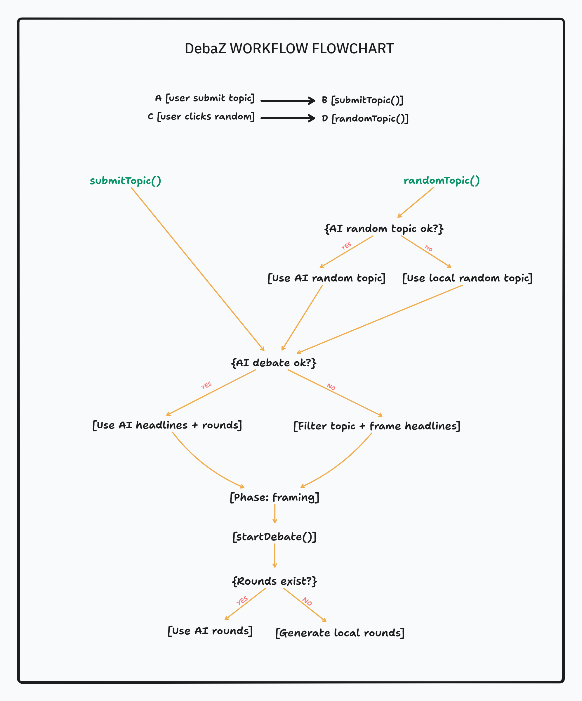

# DebaZ - AI-Powered Debate Arena
DebaZ is an interactive debate platform that pits AI-generated arguments against each other in an engaging, real-time debate experience.

## Features
*AI-Powered Debates:* Generate structured 5-round debates with AI-crafted arguments, evidence, and emotional appeals using Google Gemini API. Each debate features two opposing positions with dynamic scoring.

*Intelligent Fallback System:* Seamless local debate generation with 30+ pre-loaded topics if the API is unavailable. Fallback debates are fully featured with diverse arguments, realistic data points, and proper pro/con framing.

*Real-Time Voice Synthesis:* Native Web Speech API with customized voice profiles. PRO gets a lower-pitched authoritative voice, CON gets a higher-pitched thoughtful voice. Speech rate adapts based on argument type (logic vs emotion).

*Dynamic Evidence Visualization:* Round 3 features a live bar chart comparing debate points across evidence categories.

*Content Safety:* Built-in safety filters prevent offensive content. Single-word topic expansion (e.g., "ai" → "Artificial Intelligence Should Replace Human Decision-Making").

## System Flowchart

5-Phase Gameplay Flow:

- Input phase: Enter debate topic or get random generation
- Framing phase: Reveals pro/con positions with animated headlines
- Debate phase: 5 rounds of back-and-forth arguments with voice playback
- Voting phase: Audience participation affects scoring
- Victory screen: Final results with winner determination

### How It Works
User submits a topic or requests random generation
AI generates debate structure: topic, pro/con headlines, 10-round argument framework
App transitions through 5 phases with animated reveals
Each round alternates between PRO and CON speakers with auto-playing voice
Users vote during the debate to influence final scores
Winner is determined by cumulative scores across all rounds
If AI fails, seamless fallback to local debate generation with same quality

## Key Features Breakdown
*Smart Fallback:* 30 local fallback topics with diverse arguments if API unavailable. Fallback provides same debate structure and quality as AI-generated content.

*Voice Customization:* PRO speaker: pitch 0.85 (authoritative), CON speaker: pitch 1.2 (thoughtful). Speech rate adjusts (1.15x for logic-heavy, 0.85x for emotion-heavy).

*Scoring System:* Calculated from word count, logic score (0-100), emotion score (0-100), rebuttal strength (0-100), with bonus points for high logic+emotion combos.

*Round Types:* Each debate has 5 structure-varied rounds covering Opening Statements, Rebuttals, Evidence/Data, Emotional Appeals, and Closing Arguments.

*Performance:* Fast debates (2-3 seconds for AI generation), builds to 508KB minified, runs on any modern browser, no external dependencies for voice.