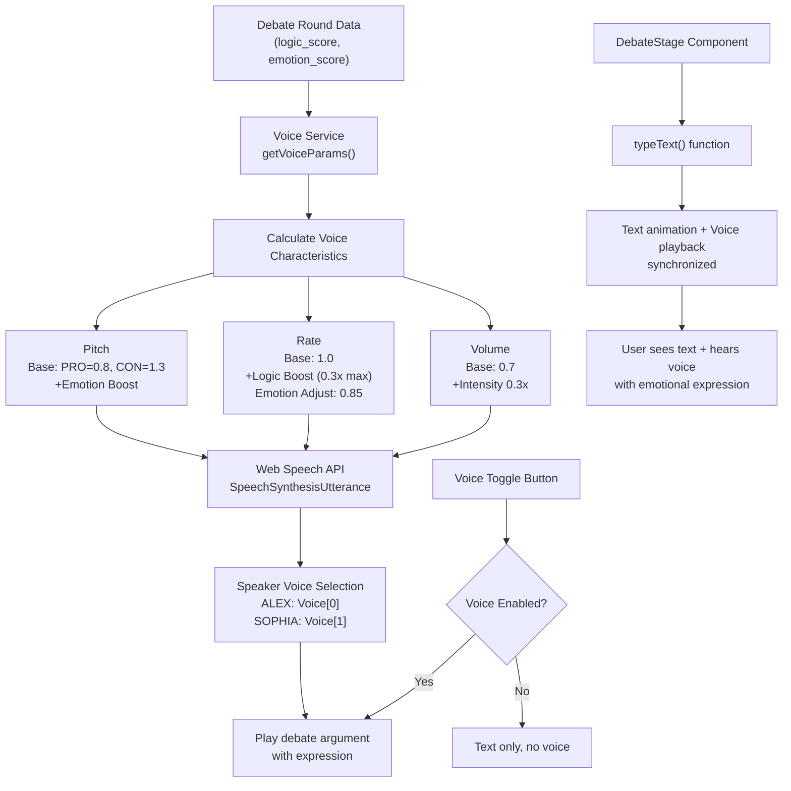

# Voice Synthesis Architecture



## Voice Parameter Mapping

### Logic Score Impact
- **Low (< 50)**: Slower delivery, flexible rate
- **Medium (50-75)**: Standard rate
- **High (> 75)**: Faster, measured delivery

### Emotion Score Impact
- **Low (< 50)**: Standard pitch, normal speed
- **Medium (50-75)**: Slight pitch increase, normal speed
- **High (> 75)**: Dramatic pitch, slower delivery (0.85x rate)

### Combined Effect Examples

| Logic | Emotion | Delivery | Pitch | Use Case |
|-------|---------|----------|-------|----------|
| 90 | 40 | Fast & measured | Low | Logical rebuttal |
| 50 | 90 | Slow & dramatic | High | Emotional appeal |
| 85 | 85 | Fast & dramatic | Med-High | Powerful closing |
| 60 | 60 | Standard | Normal | Opening statement |

## Data Flow

```
RoundData (from AI or local generation)
    ↓
DebateStage mounts
    ↓
ensureVoicesLoaded() initializes Web Speech API
    ↓
User clicks "Next" or round changes
    ↓
typeText() called with round data
    ↓
playDebateVoice() extracts metrics
    ↓
getVoiceParams() calculates pitch/rate/volume
    ↓
Text animates + voice plays simultaneously
    ↓
User hears expressive AI debate
```

## Browser Compatibility

| Browser | Support | Notes |
|---------|---------|-------|
| Chrome/Edge | ✅ Full | Best voice quality |
| Safari | ✅ Full | iOS 14.5+ required |
| Firefox | ✅ Limited | Fewer voice options |
| Opera | ✅ Full | Based on Chromium |

## Future Enhancements

1. **Premium TTS Services**
   - Google Cloud Text-to-Speech
   - ElevenLabs (custom voices)
   - AWS Polly

2. **Voice Customization**
   - User selects speaker personality
   - Custom pitch/rate ranges
   - Accent selection

3. **Audio Features**
   - Audio visualization
   - Volume control
   - Playback speed slider
   - Record/replay debates

4. **Advanced Expression**
   - SSML markup for emphasis
   - Pause simulation
   - Laughter/emotion effects
